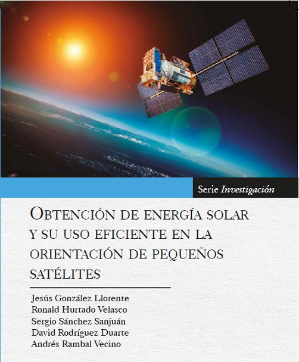

 Este libro,  resultado de un proyecto de investigación, incluye todo lo que tiene que ver con las celdas solares, la baterías, el sistema integral de energía, control de la orientación, y especialmente, la optimización del manejo y uso de la energía. Estos temas son aplicables a casi todo tipo de satélite artificial pequeño.  Se detallan todos los componentes del sistema de energía y del sistema que determina y controla la orientación del satélite.

[Descarga gratis](https://repository.usergioarboleda.edu.co/bitstream/handle/11232/652/obtenci%c3%b3n%20energ%c3%ada%20sat%c3%a9lites.pdf?sequence=8&isAllowed=y)
